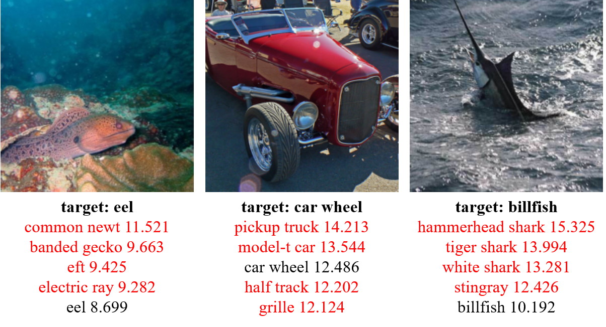
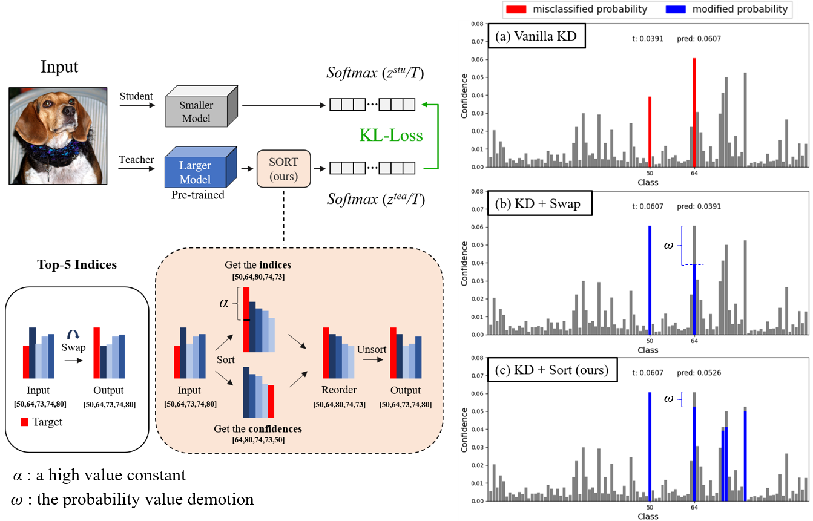

# Parameter-Free Logit Distillation via Sorting Mechanism [IEEE SPL'25]
[](https://arxiv.org/abs/2508.16544) [](https://ieeexplore.ieee.org/document/11141360/)

<div style="text-align:center"></div>

## Abstract
---
> Knowledge distillation (KD) aims to distill the knowledge from the teacher (larger) to the student (smaller) model via soft-label for the efficient neural network. In general, the performance of a model is determined by accuracy, which is measured with labels. However, existing KD approaches usually use the teacher with its original distribution, neglecting the potential of incorrect prediction. This may contradict the motivation of hard-label learning through cross-entropy loss, which may lead to sub-optimal knowledge distillation on certain samples. To address this issue, we propose a novel logit processing scheme via a sorting mechanism. Specifically, our method has a two-fold goal: (1) fixing the incorrect prediction of the teacher based on the labels and (2) reordering the distribution in a natural way according to priority rank at once. As an easy-to-use, plug-and-play pre-processing, our sort method can be effectively applied to existing logit-based KD methods. Extensive experiments on the CIFAR-100 and ImageNet datasets demonstrate the effectiveness of our method.

## Framework

<div style="text-align:center"></div>

## Installation

Environments:

- Python 3.6
- PyTorch 1.9.0
- torchvision 0.10.0

Install the package:

```
sudo pip3 install -r requirements.txt
sudo python3 setup.py develop
```

## Getting started

### 0. Wandb as the logger

- The registration: <https://wandb.ai/home>.
- If you don't want wandb as your logger, set `CFG.LOG.WANDB` as `False` at `mdistiller/engine/cfg.py`.

### 1. Training on CIFAR-100

Download the `cifar_teachers.tar` at <https://github.com/megvii-research/mdistiller/releases/tag/checkpoints> and untar it to `./download_ckpts` via `tar xvf cifar_teachers.tar`.
  
For KD:
  ```bash
  python3 tools/train.py --cfg configs/cifar100/kd.yaml
  ```
For DKD:
  ```bash
  python3 tools/train.py --cfg configs/cifar100/dkd/res32x4_res8x4.yaml
  ```
For CTKD & LSKD: Download [CTKD](<https://github.com/zhengli97/CTKD>) and [LSKD](<https://github.com/sunshangquan/logit-standardization-KD>).

### 2. Training on ImageNet

Download the dataset at <https://image-net.org/> and put them to `./data/imagenet`.
  
For KD:
  ```bash
  python3 tools/train.py --cfg configs/imagenet/r34_r18/kd.yaml
  ```
For DKD:
  ```bash
  python3 tools/train.py --cfg configs/imagenet/r34_r18/dkd.yaml
  ```
For CTKD & LSKD: Download [CTKD](<https://github.com/zhengli97/CTKD>) and [LSKD](<https://github.com/sunshangquan/logit-standardization-KD>).

## Citation

If this repo is helpful for your research, please consider citing the paper:

```BibTeX
@article{sortkd25,
  title={Parameter-Free Logit Distillation via Sorting Mechanism},
  author={Limantoro, Stephen Ekaputra},
  journal={IEEE Signal Processing Letters},
  year={2025},
  publisher={IEEE}
}
```

## Acknowledgement

This work is based on [mdistiller](<https://github.com/megvii-research/mdistiller>). 
Sincere gratitude to mdistiller, CTKD, and LSKD for their remarkable contributions.

